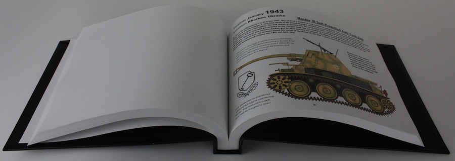
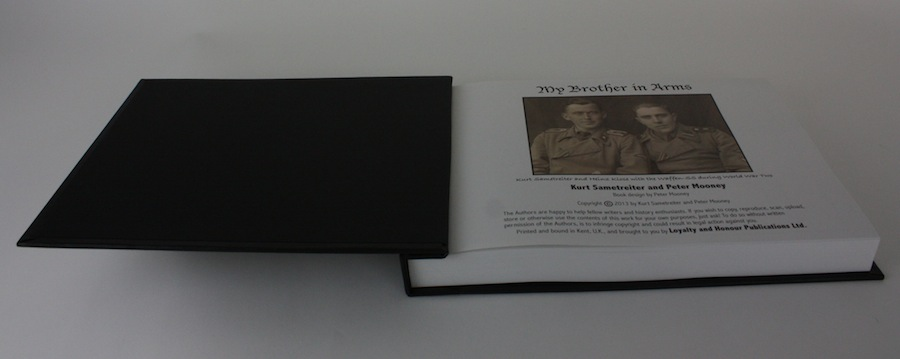
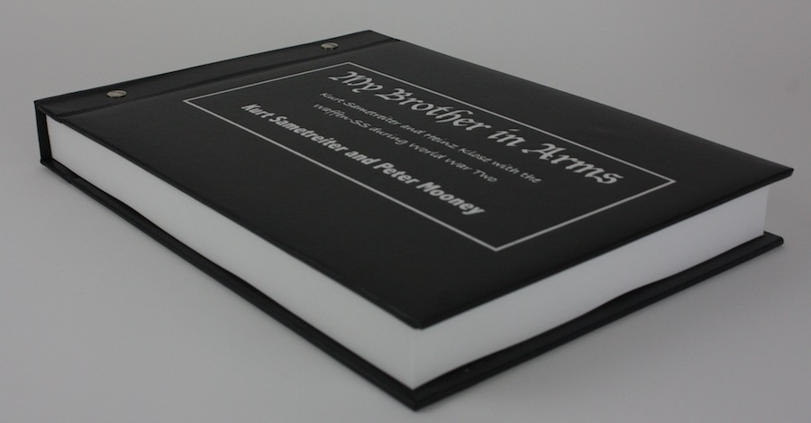

<a href="./kurt.html" class="underline">Back to the book...</a>

This latest publication adds further depth to the history of former SS-Obersturmfuhrer (1st Lieutenant) Kurt Sametreiter. This book became possible following the discovery of a 'lost' collection of more than 300 images and documents in 2013.

The additional archive contains unpublished photographs of Joachim Peiper and Werner Wolff, plus great images of Kurt, Heinz and some of the men who fought alongside them.

The book follows the same chronological format, adding additional visual insights into Kurt's history. For the first time, the Order of Battle of the Leibstandarte's Panzerjaeger Battalion is laid out.

Further discussions with Kurt, since 2013, have allowed a deeper understanding of his experiences and those who were close to him. The book itself contains:

<ul class="over">
  <li>301 photographs - almost all from the personal archive of Kurt Sametreiter</li>
  <li>Additional images and insight obtained from 1st SS Kameraden Hans Baumann</li>
  <li>39 period documents that help provide additional detail</li>
</ul>

This book is an excellent and important companion to Book One, and like that book, emulates the war-time photo albums. The thick, padded and embossed leatherette cover is wrapped around 145 high quality, high gloss pages.

<!--
<b>Each of the first 100 books are individually numbered and contain the stamped signature of Kurt Sametreiter (He is unable to write due to Parkinson's Disease). The additional Author signature will be added, together with an inscription of your choosing. </b>
-->

  <ul>
    <li></li>
    <li></li>
    <li></li>
  </ul>

