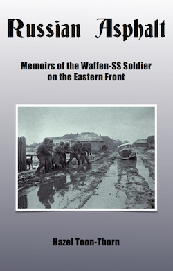
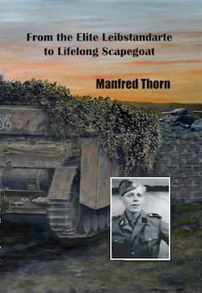

  <h3>"Russian Asphalt: Memoirs of the Waffen-SS Soldier on the Eastern Front", by Hazel Toon-Thorn</h3>
  

  
This new title, written by Hazel Toon-Thorn (wife of LSSAH Panzer IV driver, Manfred Thorn), who has compiled a series of recollections from former soldiers of the Waffen-SS.

  
These recollections cover all aspects of the fighting against the Soviets between 1941 and 1945, from the heady days of advance into Russia, right up to fighting near Berlin. The book features lots of interview excerpts and is placed within an overall framework of what was unfolding during those years.

  
A great insight into the personal experiences of the 'soldier on the ground' during this titanic military struggle. This book contains a Foreword by former SS-Obersturmfuhrer Paul Rosch, who served with the 5th and 16th SS Divisions.

  
Soft cover, A5 format, 236 pages, 70 photographs and 6 maps.  Price: &pound;17.00 (postage extra)

  
Please email with your order to <a href="mailto:contactus@lahpublishing.com">contactus@lahpublishing.com</a>

  
Customer Feedback:

  
"As soon as I finished reading this one I started reading it again, and now for a third time.

  I have only seen documentary films on the World Wars, and never read any accounts.  All the documentaries I have seen have something deep which is missing from them.  I really don't know even now what missing, but I was never satisfied with their stories.  Maybe that was it.  I always felt I was being told a "story" ... being told what to think.  But finally I now have a book which shows the true nature of the SS soldier and the profound implications for the history we have been fed.  And that nature is just amazing ... to uphold justice with such power.  I had given up hope that any people could be like this.
  Besides the nature of the SS soldier, there is also some little implications of the truth of what happened to Germany, and the truth about what The Allies did.
  It is also a great thing to read the accounts of those soldiers.  Just their accounts, without any other writing to steer the reader's thoughts.  Hazel Toon-Thorn's comments are helpful, including her own interest in the matter ... "Why?"
  I haven't read other books on the truth of what happened to Germany and Hitlers efforts, or the efforts and lives of the people in those times, but I'm sure Russian Asphalt is, for all practical purposes, unique.
  What a valuable book!"

  
Tim Douglas, Australia

  <h3>"Hitler's Teenaged Warriors: Karl-Heinz Decker 12th SS-Panzer Division Hitlerjugend" by James Wilson</h3>
  

  
This book, written by James Wilson, covers the personal history of former 12. SS-Panzer Division soldier, Karl-Heinz Decker.

  
He joined that Division in 1943 and fought with them during the Normandy campaign, where he was wounded and captured

  
Soft cover, A5 format  Price: &pound;13.00 (postage extra)

  
Please email with your order to <a href="mailto:contactus@lahpublishing.com">contactus@lahpublishing.com</a>

  <h3>"From the Elite Leibstandarte to Lifelong Scapegoat" by Manfred Thorn</h3>
  

  
This new title for 2015, is the memoirs of Manfred Thorn, (1. SS-Panzer Division, Panzer IV driver).

  
These memoirs cover his life as a youth, then through to service in the Hitler Jugend, then onto his eventual combat service with the elite Leibstandarte SS-Adolf Hitler Division from 1943 through to 1945.

  
It also covers his post-war experiences as one of the 'Malmedy Men' and also how he build a life for himself after the war.

  
Hard cover, A5 format, 241 pages.  Price: &pound;22.50 (postage extra). Expected late-July 2015.

  
Please email with your order to <a href="mailto:contactus@lahpublishing.com">contactus@lahpublishing.com</a>

