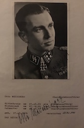

  
  
Below is the current list of available signed Waffen-SS Knight's Cross holder photographs and documents

  
Your opportunity to add to your existing collection, or begin one from scratch. 

  
Some of these are wartime originals (indicated), some are postwar signed

  
If you do not see your 'wants' on this list, email me and I will aim to help. I have extensive links with fellow collectors, who do (like myself), move on items from time to time; it's always worth asking! 
 
  
   
  
  <h3>Herbert-Otto Gille</h3>
  
  
  
Clipped wartime signature, with final rank above

  
Placed underneath a wartime Knight's Cross, Oakleaves and Swords postcard

  
The postcard is Nr. 5 from the 'Die Kriegsorden des Grossdeutschen Reiches' series

  
Herbert-Otto Gille was one of only 27 soldiers awarded the Diamonds to the Knight's Cross.

  
He was the most-decorated soldier of the Waffen-SS; he held SS-Obergruppenfuhrer rank.

  
Commanded Korps-level formations, as well as the 5. SS-Pz.Div. 'Wiking'.

  
Mounted in a cream and black mount, ready to add to a frame of your chosing.

  
Price is: £300.00

  
   
  
  <h3>Matthias Kleinheisterkamp</h3>
  
  
  
Clipped wartime signataure

  
Dates late-February 1945, when Kleinheisterkamp commanded the XI. SS-Armeekorps

  
SS-Obergruppenfuhrer rank listed underneath

  
Kleinheisterkamp was awarded the Knight's Cross with Oakleaves

  
He commanded multiple SS-Divisions and SS-Korps

  
Kleinheisterkamp commanded more Korps-level commands that any other Waffen-SS soldier.

  
Price is: £250.00

  
   
  
  <h3>Karl Brenner</h3>
  
  
  
Wartime signed document

  
Karl Brenner commanded the 6. SS-Gebirgs Division 'Nord'

  
Brenner was awarded the Knight's Cross

  
This document is discussing and approving the award for two of his soldiers.

  
Price is: £250.00

  
   
  
  <h3>Various signed photos - individual images can be sent on request</h3>
  
  
Paul Hausser	signed photo (larger format, with Oakleaves). Price £200.00

  
Theodore Wisch signed book photo & signed letter. Price £50.00

  
Heinz Harmel signed photo page and info page. Price £40.00 

  
Sylvester Stadler signed photocopy page and signed letter. Price £40.00

  
Karl Ullrich signed Knight's Cross postcard and info page. Price £35.00

  
Karl Kreutz signed photo & 4 signed letters / notes. Price £45.00

  
Otto Weidinger signed photo and info page. Price £40.00

  
Fritz Richter signed photo and info page. Price £30.00

  
Karl Sattler signed Knight's Cross postcard and picture info page. Price £30.00

  
Fritz Rieflin signed photo and info page. Price £30.00

  
Rudolf Sandig signed Knight's Cross postcard and picture info page. Price £30.00

  
Johannes Scherg signed Knight's Cross postcard and picture info page. Price £30.00

  
Walter Schmidt signed Knight's Cross postcard and headed signed letter. Price £35.00

  
Alfred Schneidereit signed photocopy picture info page. Price £25.00

  
Gustav Schreiber signed photo and info page. Price £30.00

  
Heinrich Sonne signed Knight's Cross award photo info page. Price £30.00

  
Gustav-Peter Reber signed photo and info page. Price £30.00

  
Walter Reder signed photo, headed and signed photo from 1986, signed letter from Gaeta 1972. Price £50.00

  
Hermann Marringgele signed photo and info page. Price £30.00

  
Sepp Lainer signed photo and info page. Price £30.00

  
Kurt Launer signed photo and info page. Price £30.00

  
Hans-Heinrich Lohmann signed photo and info page. Price £35.00

  
Willi Hund signed photo. Price £30.00

  
Heinz Jurgens signed photo and info page. Price £30.00

  
Soren Kam signed photo and info page. Price £30.00

  
Karl-Heinz Gustavsson signed photo and info page. Price £30.00

  
Franz Hack signed photo and info page. Price £40.00

  
Gerhard Fischer signed photo and info page. Price £30.00

  
Hugo Eichorn signed photo and info page. Price £30.00

  
Jakob Fick signed photo and info page. Price £30.00

  
  
  
  
  
  
  
 
   
   
  
  <h3>Please email with your order to <a href="mailto:contactus@lahpublishing.com">contactus@lahpublishing.com</a></h3>

